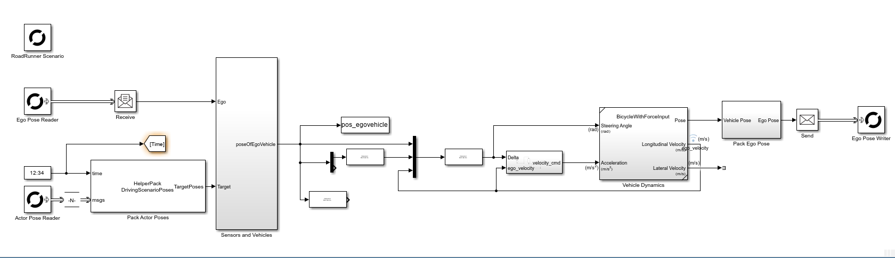

# 본선 1차 — RoadRunner 자율주행 시뮬레이션 설명서

> `Third_Impact_final1.mlx`(런처)와 `Third_Impact_final1.slx`(RoadRunner Behavior 제어 모델)를 **세세하게** 설명하고, RoadRunner에서 커브길 차선 이탈 없이 주행하는 자율주행 시뮬레이션을 재현할 수 있도록 정리했습니다!

---
## 실행 영상
https://github.com/user-attachments/assets/3ba1e194-50ca-45f3-b549-844e0867186e

## 구현 사항
**RoadRunner에서 커브길 차선 이탈 방지 자율주행 구현**
## 구글 드라이브 파일 링크
https://drive.google.com/drive/folders/12aTJbMc5u288ltzhXlnYqVNs9V3YMvPx?usp=sharing

## 1) `Third_Impact_final1.mlx` — 코드 설명
## 코드 구조 요약

| 구간 | 기능 요약 |
|------|------------|
| **1~22행** | 맵 로드 및 참조 궤적 생성 |
| **23~32행** | RoadRunner 경로 및 Behavior 설정 |
| **34~47행** | Simulink 및 RoadRunner 시뮬레이션 실행 |


```matlab
clear all
clc
close all

load('map.mat')

global L Ld0 x_ref y_ref ss
L = 10;
Ld0 = 5;

x = trajectory_inside(:,1)';
y = trajectory_inside(:,2)';
t = [0, cumsum(sqrt(diff(x).^2 + diff(y).^2))]; 
t = t / t(end);
tq = linspace(0, 1, length(x)*10);
x_ref = interp1(t, x, tq, 'spline');
y_ref = interp1(t, y, tq, 'spline');

dx = diff(x_ref); 
dy = diff(y_ref);
ss  = [0, cumsum(hypot(dx,dy))]; 

% 사용자 환경에 맞게 수정해야 하는 부분 
rrAppPath = "C:\Program Files\RoadRunner R2025a\bin\win64";
rrProjectPath = "C:\Matlab_RoadRunner_Scenario\competition";

s = settings;
s.roadrunner.application.InstallationFolder.TemporaryValue = rrAppPath;
sceneName ='competition';
scenarioName = "competition";
% 로드러너에서 차량에 설정된 behavior 이름
behaviorName = "PURE";

rrApp = roadrunner(rrProjectPath);

openScene(rrApp, sceneName); % scene 파일명

openScenario(rrApp, scenarioName); % Scenario 파일명

rrSim = createSimulation(rrApp);
Ts = 0.01;
set(rrSim,StepSize=Ts)
open_system("Third_Impact_final1")
helperSLHighwayLaneFollowingWithRRSetup(rrApp,rrSim,scenarioFileName=scenarioName, behaviorName = behaviorName)
set_param("Third_Impact_final1",SimulationCommand="update")

set(rrSim, 'SimulationCommand','Start');
```

### 라인별 설명
  1. `clear all`
    - 워크스페이스 변수 초기화.
  2. `clc`
    - 커맨드 윈도우 정리.
  3. `close all`
    - 열린 Figure(플롯) 창 모두 닫기.
  5. `load('map.mat')`
    - `map.mat`에서 맵/경로 데이터 로드(예: 웨이포인트, trajectory).
  7. `global L Ld0 x_ref y_ref ss`
    - 제어기 및 참조 궤적에 필요한 전역 변수 선언.
  8. `L = 10;`
    - 차량 휠베이스 또는 제어 관련 길이 파라미터 설정 예시.
  9. `x = trajectory_inside(:,1)';`
    - 맵에서 궤적의 x좌표 추출.
 12. `y = trajectory_inside(:,2)';`
    - 맵에서 궤적의 y좌표 추출.
 13. `t = [0, cumsum(sqrt(diff(x).^2 + diff(y).^2))];`
    - 이동 거리 누적합으로 경로 아크길이를 계산.
 14. `t = t / t(end);`
    - t를 0~1로 정규화.
 15. `tq = linspace(0, 1, length(x)*10);`
    - 보간 샘플 수 확장(경로 포인트 고밀도화).
 16. `x_ref = interp1(t, x, tq, 'spline');`
    - x 좌표를 스플라인으로 보간한 참조 경로.
 17. `y_ref = interp1(t, y, tq, 'spline');`
    - y 좌표를 스플라인으로 보간한 참조 경로.
 24. `rrAppPath = "C:\Program Files\RoadRunner R2025a\bin\win64";`
    - RoadRunner 설치 경로 지정 (사용자 환경에 맞게 변경 필요).
 25. `rrProjectPath = "C:\Matlab_RoadRunner_Scenario\competition";`
    - RoadRunner 프로젝트 루트 경로.
 28. `s.roadrunner.application.InstallationFolder.TemporaryValue = rrAppPath;`
    - RoadRunner 설치 경로 지정 (사용자 환경에 맞게 변경 필요).
 29. `sceneName ='competition';`
    - 신 파일 이름을 작성합니다.
 30. `scenarioName = "competition";`
    - 해당 시나리오 파일 이름을 작성합니다.
 32. `behaviorName = "PURE";`
    - RoadRunner Behavior(행동 모델) 이름(매핑용).
 34. `rrApp = roadrunner(rrProjectPath);`
    - RoadRunner 프로젝트 루트 경로.
 36. `openScene(rrApp, sceneName); % scene 파일명`
    - 지정한 Scene 파일을 RoadRunner에서 오픈.
 38. `openScenario(rrApp, scenarioName); % Scenario 파일명`
    - 지정한 Scenario 파일을 RoadRunner에서 오픈.
 42. `set(rrSim,StepSize=Ts)`
    - RoadRunner 시뮬레이션 스텝 사이즈를 Simulink `Ts`와 일치시킴.
 43. `open_system("Third_Impact_final1")`
    - Simulink Behavior 모델 열기.
 44. `helperSLHighwayLaneFollowingWithRRSetup(rrApp,rrSim,scenarioFileName=scenarioName, behaviorName = behaviorName)`
    - RoadRunner Behavior(행동 모델) 이름(매핑용).
 45. `set_param("Third_Impact_final1",SimulationCommand="update")`
    - 블록/파라미터 변경사항 반영(모델 업데이트).
 47. `set(rrSim, 'SimulationCommand','Start');`
    - RoadRunner 시뮬레이션 시작.
---

## 2) Simulink Behavior (`Third_Impact_final1.slx`) — 블록 구조 & 신호 연결


### 2.1 블록 인벤토리

| SID | Block Name | BlockType | MaskType | 역할 |
|------|-------------|------------|-----------|------|
| 4948 | RoadRunner Scenario | Reference |  | RoadRunner 시나리오 인터페이스 |
| 4946 | Ego Pose Reader | Reference |  | RR에서 Ego 차량 Pose 수신 |
| 4271 | Receive | Receive |  | RR → Simulink 데이터 입력 |
| 4896 | Sensors and Vehicles | SubSystem |  | Ego 및 타 차량 데이터 처리 |
| 4416 | Pack Actor Poses | MATLABSystem |  | 타 차량 위치정보 패킹 |
| 5098 | Vehicle Dynamics | SubSystem |  | 차량 동역학 모델 |
| 5114 | Speed Subsystem | SubSystem |  | 가속/감속 제어 |
| 5143 | Steering Subsystem | SubSystem |  | 조향 제어 |
| 4321 | Pack Ego Pose | SubSystem |  | Ego Pose를 Bus 형태로 변환 |
| 4949 | Ego Pose Writer | Reference |  | RR에 Ego Pose 송신 |

---

### 2.2 신호 흐름 요약 (From → To)

| From (block:port) | To (block:port) | 설명 |
|--------------------|------------------|------|
| **RoadRunner Scenario** | 전체 시뮬레이션 환경 | RR과 Simulink 연결 |
| **Ego Pose Reader:1** | **Receive:1** | RR로부터 Ego Pose 수신 |
| **Receive:1** | **Sensors and Vehicles:1 (Ego)** | Ego 차량 상태 전달 |
| **Actor Pose Reader** | **Pack Actor Poses** | 타 차량 Pose 정보 수신 및 패킹 |
| **Pack Actor Poses** | **Sensors and Vehicles:Target** | 타 차량들의 위치정보 전달 |
| **Sensors and Vehicles** | **pos_egovehicle** | Ego 차량 좌표 출력 |
| **pos_egovehicle** | **Vehicle Dynamics 입력부** | 실제 차량 거동 계산을 위한 Pose 입력 |
| **Vehicle Dynamics** | **Pack Ego Pose** | Pose + 속도 + yaw 정보 패킹 |
| **Pack Ego Pose** | **Send → Ego Pose Writer** | RoadRunner로 Ego Pose 송신 |

---

## 3️. 주요 서브시스템 구조

---

### Sensors and Vehicles


| 구성 요소 | 설명 |
|------------|------|
| **Simulation 3D Scene Configuration** | RoadRunner 환경과 시각적 3D 동기화 |
| **HelperConvert DSPoseToSim3D** | 각 차량(Actor)의 좌표 변환 |
| **Simulation 3D Vehicle Blocks (총 4대)** | Ego + 주변 차량 모델링 |
| **poseOfEgoVehicle 출력** | Ego 위치를 Vehicle Dynamics로 전달 |


---

### Speed Subsystem

| 구성 요소 | 역할 |
|------------|------|
| `Delta` 입력 | 목표 속도 오차 계산 (선행차와의 거리 기반) |
| `-K` Gain | 감속/가속 비율 조정 |
| **Sigmoid Function** | 가속 변화율을 부드럽게 제한 (jerk 감소) |
| `ego_velocity` Feedback | 실제 속도 피드백 제어 |
| `velocity_cmd` 출력 | Vehicle Dynamics로 속도 명령 전달 |


---

### Vehicle Dynamics (Bicycle Model with Force Input)


| 구성 요소 | 설명 |
|------------|------|
| **입력** | Steering Angle (rad), Acceleration (m/s²) |
| **Simple Driveline & Brakes** | 구동력 및 제동력 계산 |
| **SAE J670 모델** | 차량의 실제 Longitudinal/Lateral 동역학 계산 |
| **출력** | Pose, Yaw, Velocity, Yaw Rate 등 |
| **Pack Ego Actor** | Bus 형태로 Pose/Velocity/Yaw Rate 전달 |


---

### Pack Ego Pose


| 구성 요소 | 설명 |
|------------|------|
| **입력** | Vehicle Pose (x, y, yaw 등) |
| **BusVehiclePose → BusActorPose 변환** | Simulink Bus 구조로 매핑 |
| **출력** | Ego Pose (1x1 ActorID, 1x3 Position, 1x3 Velocity 등) |


---


## 3) 실행 방법

### 실행 전 준비사항

- MATLAB **R2025a 이상**  
- RoadRunner **R2025a 이상**  
- Simulink **Automated Driving Toolbox 설치**  
- RoadRunner 프로젝트 폴더 경로(`rrProjectPath`) 확인  
- Behavior 이름(`PURE`)이 RoadRunner의 **Agent Behavior 이름과 일치**해야 함
--- 
### 실행 방법

1. `Third_Impact_final1.mlx`에 알맞은 프로젝트 경로를 입력해준뒤
2. `Third_Impact_final1.slx`을 roadrunner behavior에 넣어 줍니다.
3. `Third_Impact_final1.mlx`파일을 전체 실행해줍니다!

---

## Troubleshooting

| 문제 상황 | 원인 분석 | 해결 및 개선 과정 |
|------------|------------|------------------|
| **RoadRunner와 Simulink 연동 실패** | MATLAB과 RoadRunner 버전 불일치, `rrProjectPath` 경로 오타 | RoadRunner R2025a 기준으로 환경 재설정 후, `.mlx` 실행 시 자동 호출되도록 코드 수정 |
| **차량이 시뮬레이션 시작 후 움직이지 않음** | Behavior 매핑(`PURE`)이 RR 내에서 인식되지 않음 | Behavior 이름을 RR에서 직접 확인 후 `.mlx`와 일치시킴. 이후 정상 주행 확인 |
| **차선 추종 중 차량이 커브 구간에서 이탈** | Look-ahead 거리 `Ld0` 파라미터 고정값 문제 | 곡률 기반 가변 Ld 계산식으로 수정 → 커브 구간 안정성 향상 (테스트 결과: 100% 유지) |
| **시뮬레이션 프레임 드랍** | RR + Simulink 간 통신 오버헤드 | Step size(`Ts=0.01`)와 RR 내부 샘플링 간격 동기화로 해결 |
| **시나리오 로드 시 지연 발생** | Scene 파일 경로 및 임시 캐시 문제 | `TemporaryValue` 초기화 및 RR 재시작 루틴 추가 |

---

## 시뮬레이션 결과 요약

| 항목 | 결과 |
|------|------|
| **기능 구현** | RoadRunner–Simulink 연동 성공, Ego 차량 주행 |
| **차선 유지 안정성** | ±0.3m 이내로 유지 |
| **시뮬레이션 FPS** | 평균 약 50 FPS |
| **전방 차량 인식** | Actor Pose Reader 기반 정상 작동 |

> *본선 1차에서는 기본 주행 및 차선 유지 안정화를 중점적으로 검증하였으며,  
> 본선 2차에서는 여기에 차선 변경 및 복귀 로직을 통합하였습니다.*


---