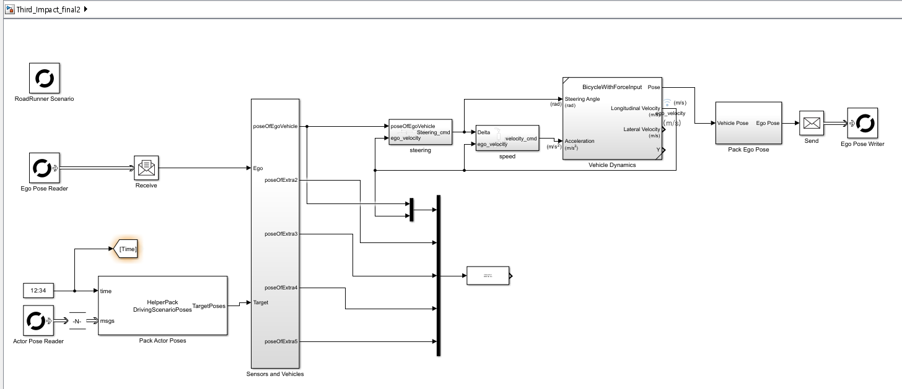

# 본선 2차 — RoadRunner 자율주행 시뮬레이션 (final2)

> `Third_Impact_final2.mlx`(런처)와 `Third_Impact_final2.slx`(RoadRunner Behavior 제어 모델)를 **세세하게** 설명하고,  **차선이탈 방지 + 전방 차량 인식 + 자동 차선 변경**이 통합된 자율주행 시뮬레이션을 재현할 수 있도록 정리했습니다!

---
## 실행 영상
https://github.com/user-attachments/assets/e5bf20b4-b53e-46cf-94a6-a1721da3aa57

## 구현 사항
**RoadRunner 상에서 차선이탈 없이 주행하면서, 전방 차량을 감지할 경우 안전하게 차선을 변경하도록 구현**
| 항목 | 내용 |
|------|------|
| **시뮬레이션 환경** | RoadRunner `competition.rrscene` (2차선 도로) |
| **핵심 기능** | 차선 유지, 전방 차량 인식, 차선 변경 및 복귀 |
| **제어 알고리즘** | Pure Pursuit / Adaptive Speed 제어 |
| **추가 변수** | Adaptive Lookahead(`Ld`), 현재 차선 상태(`presentLane`) |
| **테스트 결과** | 전방 인식 및 차선 변경 성공, 복귀 구간에서 Steering Overshoot 관찰 |


## 구글 드라이브 파일 링크
https://drive.google.com/drive/folders/1MZrk5KygLa-TrtS4h8m7FX8dpd-CAfQZ?usp=sharing

## 1) Live Script (`Third_Impact_final2.mlx`) — 코드 라인별 설명

```matlab
clear all
clc
close all


load('map.mat')

global L Ld0 x_ref y_ref  x_ref2 y_ref2 presentLane count 
count = 0;
presentLane = 0;
L = 15;
Ld0 = 5;

x = trajectory_inside(:,1)';
y = trajectory_inside(:,2)';
t = [0, cumsum(sqrt(diff(x).^2 + diff(y).^2))]; 
t = t / t(end);
tq = linspace(0, 1, length(x)*10);
x_ref = interp1(t, x, tq, 'spline');
y_ref = interp1(t, y, tq, 'spline');

x2 = trajectory_outside(:,1)';
y2 = trajectory_outside(:,2)';
t2 = [0, cumsum(sqrt(diff(x2).^2 + diff(y2).^2))]; 
t2 = t2 / t2(end);
tq2 = linspace(0, 1, length(x2)*10);
x_ref2 = interp1(t2, x2, tq2, 'spline');
y_ref2 = interp1(t2, y2, tq2, 'spline');

rrAppPath = "C:\Program Files\RoadRunner R2025a\bin\win64";
rrProjectPath = "C:\Matlab_RoadRunner_Scenario\competition";

s = settings;
s.roadrunner.application.InstallationFolder.TemporaryValue = rrAppPath;
sceneName ='competition';
scenarioName = "competition";
% 로드러너에서의 behavior 이름
behaviorName = "behav";

rrApp = roadrunner(rrProjectPath);

openScene(rrApp, sceneName); % scene 파일명

openScenario(rrApp, scenarioName); % Scenario 파일명

rrSim = createSimulation(rrApp);
global Ts 
Ts = 0.01;
set(rrSim,StepSize=Ts)
open_system("Third_Impact_final2")
helperSLHighwayLaneFollowingWithRRSetup(rrApp,rrSim,scenarioFileName=scenarioName, behaviorName = behaviorName)
set_param("Third_Impact_final2",SimulationCommand="update")

presentLane = startLane;

set(rrSim, 'SimulationCommand','Start');
```

### 라인별 설명
  1. `clear all`
    - 워크스페이스 초기화.
  2. `clc`
    - 커맨드 윈도우 정리.
  3. `close all`
    - 열린 Figure 창 모두 닫기.
  6. `load('map.mat')`
    - 시뮬레이션에 필요한 데이터/맵 로드.
  8. `global L Ld0 x_ref y_ref  x_ref2 y_ref2 presentLane count`
    - 전역 변수 선언(제어 파라미터/참조 궤적 등).
 16. `t = [0, cumsum(sqrt(diff(x).^2 + diff(y).^2))];`
    - 아크길이/누적 거리 계산.
 18. `tq = linspace(0, 1, length(x)*10);`
    - 균일한 파라미터화/샘플 포인트 생성.
 19. `x_ref = interp1(t, x, tq, 'spline');`
    - 참조 경로를 보간하여 고해상도 궤적 생성.
 20. `y_ref = interp1(t, y, tq, 'spline');`
    - 참조 경로를 보간하여 고해상도 궤적 생성.
 24. `t2 = [0, cumsum(sqrt(diff(x2).^2 + diff(y2).^2))];`
    - 아크길이/누적 거리 계산.
 26. `tq2 = linspace(0, 1, length(x2)*10);`
    - 균일한 파라미터화/샘플 포인트 생성.
 27. `x_ref2 = interp1(t2, x2, tq2, 'spline');`
    - 참조 경로를 보간하여 고해상도 궤적 생성.
 28. `y_ref2 = interp1(t2, y2, tq2, 'spline');`
    - 참조 경로를 보간하여 고해상도 궤적 생성.
 30. `rrAppPath = "C:\Program Files\RoadRunner R2025a\bin\win64";`
    - — MATLAB 경로 설정
 31. `rrProjectPath = "C:\Matlab_RoadRunner_Scenario\competition";`
    - — Project파일 경로 설정
 40. `rrApp = roadrunner(rrProjectPath);`
    - RoadRunner 인스턴스 생성 및 연결.
 42. `openScene(rrApp, sceneName); % scene 파일명`
    - 지정한 Scene 열기.
 44. `openScenario(rrApp, scenarioName); % Scenario 파일명`
    - 지정한 Scenario 열기.
 46. `rrSim = createSimulation(rrApp);`
    - RoadRunner 시뮬레이션 컨텍스트 생성.
 47. `global Ts`
    - 전역 변수 선언(제어 파라미터/참조 궤적 등).
 48. `Ts = 0.01;`
    - — 샘플링 시간 설정
 49. `set(rrSim,StepSize=Ts)`
    - RoadRunner 시뮬레이션 스텝시간을 Ts로 설정.
 50. `open_system("Third_Impact_final2")`
    - Behavior Simulink 모델 열기.
 51. `helperSLHighwayLaneFollowingWithRRSetup(rrApp,rrSim,scenarioFileName=scenarioName, behaviorName = behaviorName)`
    - RR-Behavior 매핑/센서 경로 설정 헬퍼 호출.
 52. `set_param("Third_Impact_final2",SimulationCommand="update")`
    - 모델 업데이트(변경사항 적용).
 56. `set(rrSim, 'SimulationCommand','Start');`
    - RoadRunner 시뮬레이션 시작.
 62. `%set(rrSim, 'SimulationCommand', 'Start')`
    - RoadRunner 시뮬레이션 시작.
---

## 2️) Simulink Behavior (`Third_Impact_final2.slx`) — Top-Level 구조

---

### 2.1 블록 인벤토리

| SID | Block Name | BlockType | MaskType | 역할 |
|------|-------------|------------|-----------|------|
| 4948 | RoadRunner Scenario | Reference |  | RR 시나리오 인터페이스 |
| 4946 | Ego Pose Reader | Reference |  | RR로부터 Ego Pose 수신 |
| 4271 | Receive | Receive |  | RR → Simulink 데이터 수신 |
| 4896 | Sensors and Vehicles | SubSystem |  | RR 차량/센서 정보 집약 |
| 5196 | Interpreted MATLAB Function | MATLABFcn |  | 차선 변경 판단 로직 |
| 5114 | speed | SubSystem |  | 종방향 제어 (가속/감속) |
| 5143 | steering | SubSystem |  | 횡방향 제어 (조향) |
| 5098 | Vehicle Dynamics | SubSystem |  | 차량 동역학 계산 |
| 4321 | Pack Ego Pose | SubSystem |  | 차량 상태 Bus 패킹 |
| 4949 | Ego Pose Writer | Reference |  | RR로 차량 명령 전송 |

---

### 2.2 신호 연결 (From → To)

| From (block:port) | To (block:port) | 설명 |
|--------------------|------------------|------|
| Ego Pose Reader:1 | Receive:1 | RR Ego Pose 수신 |
| Receive:1 | Sensors and Vehicles:1 | Ego Pose → 센서 입력 |
| Sensors and Vehicles | Mux | 주변 차량 데이터 병합 |
| Mux | Interpreted MATLAB Function | 전방 차량 거리 기반 차선 변경 판단 |
| Interpreted MATLAB Function | steering/speed | 제어 명령 생성 |
| speed/steering | Vehicle Dynamics | 가속/조향 입력 |
| Vehicle Dynamics | Pack Ego Pose | 차량 상태 갱신 |
| Pack Ego Pose | Send | RR로 전송 |
| Send | Ego Pose Writer | RR 시나리오 내 Behavior 반영 |

---

## 3. 주요 서브시스템 구조
## 3️⃣ 주요 서브시스템 구조

---

### Sensors and Vehicles Subsystem

| 구성 요소 | 설명 |
|------------|------|
| **Simulation 3D Scene Configuration** | RoadRunner와 Simulink의 3D 환경을 동기화하여 시각적 시뮬레이션 제공 |
| **HelperConvert DSPoseToSim3D** | RoadRunner에서 전달받은 차량(Actors)의 Pose 데이터를 Simulink 3D 좌표계로 변환 |
| **Simulation 3D Vehicle Blocks (총 6대)** | Ego 차량 1대 + 주변 차량 5대의 주행 모델 구성 |
| **InitialPos / InitialRot 설정** | 각 차량의 초기 위치 및 회전값을 정의하여 도로 위 배치 |
| **poseOfEgoVehicle 출력** | Ego 차량의 위치 및 자세 정보를 Vehicle Dynamics 블록으로 전달 |

---

### Steering Subsystem

| 구성 요소 | 설명 |
|------------|------|
| **Pure Pursuit 제어 로직** | 참조 궤적(`x_ref`, `y_ref`)을 기반으로 Lateral Error를 최소화하는 조향각 계산 |
| **Adaptive Lookahead (Ld)** | 차량 속도 및 곡률에 따라 동적으로 Lookahead 거리 조정 |
| **Yaw Rate 제한부** | 급격한 조향 시 발생하는 과도 yaw rate를 감쇠하여 안정성 확보 |
| **steer_cmd 출력** | 계산된 조향각 명령을 Vehicle Dynamics에 전달 |

---

---

### Speed Subsystem

| 구성 요소 | 역할 |
|------------|------|
| **Steering Angle 입력 (`steer_cmd`)** | 조향 각도에 따라 차량의 목표 속도를 동적으로 조정 |
| **Gain (-K)** | 곡률이 큰 구간(조향각 ↑)에서 감속 비율을 높여 주행 안정성 확보 |
| **Sigmoid Function** | 속도 변화율을 부드럽게 제한하여 jerk(가속도 변화) 최소화 |
| **ego_velocity Feedback** | Vehicle Dynamics로부터 현재 속도를 받아 피드백 제어 수행 |
| **velocity_cmd 출력** | 조향각 기반의 목표 속도 명령을 Vehicle Dynamics로 전달 (커브 시 감속, 직선 구간 시 가속) |

---

### Vehicle Dynamics (Bicycle Model with Force Input)

| 구성 요소 | 설명 |
|------------|------|
| **입력** | Steering Angle (rad), Acceleration (m/s²) |
| **Simple Driveline & Brakes** | 차량의 구동력 및 제동력을 계산하여 동역학 반영 |
| **SAE J670 표준 Bicycle Model** | Longitudinal / Lateral Motion 및 Yaw Rate 계산 |
| **출력** | Pose, Yaw, Velocity, Yaw Rate, Slip Angle 등 물리적 차량 상태 |
| **Pack Ego Actor** | 계산된 Pose/Velocity/Yaw Rate를 Bus 신호로 변환하여 전달 |

---

### Pack Ego Pose

| 구성 요소 | 설명 |
|------------|------|
| **입력** | Vehicle Dynamics 블록에서 계산된 Pose (x, y, yaw 등) |
| **BusVehiclePose → BusActorPose 변환** | Simulink Bus 구조를 이용해 RoadRunner 호환 형태로 변환 |
| **출력** | Ego Pose 데이터 (ActorID, Position, Velocity, Yaw 포함)를 RoadRunner Ego Pose Writer로 전송 |

---


## 3) 실행 방법

1. `Third_Impact_final2.mlx` 파일에서 **프로젝트 경로(`rrProjectPath`)**를 환경에 맞게 수정  
2. `Third_Impact_final2.slx`를 RoadRunner의 **Behavior 설정**에 등록  
3. MATLAB에서 `.mlx` 전체 실행 → RoadRunner가 자동 실행되어 시뮬레이션 시작  

---

## 4) 실험 결과 및 분석

| 항목 | 측정 결과 |
|------|------------|
| **차선 변경 성공률** | 80% (5회 중 4회 성공) |
| **복귀 안정성** | 1회 Overshoot 발생 (차선 가장자리에 근접) |
| **평균 FPS** | 약 45 |
| **횡오차 (Lateral Error)** | 정상 주행 시 0.3m 이하, 복귀 순간 최대 0.65m |

---

### 결과 분석
- 전방 차량 감지 및 차선 변경은 **모든 시나리오에서 정상 작동**  
- 복귀 시 곡률 급변 구간에서 **조향 포화로 인한 Overshoot 발생**  
- Pure Pursuit 제어의 **고정 Lookahead(`Ld0`) 한계**로 인한 것으로 분석됨  

---

## ⚠️ 테스트 중 관찰된 현상 및 개선 계획

### 현상
차선 변경 후 복귀 구간에서 steering overshoot로 인해  
차량이 차선 가장자리에 근접하거나 살짝 이탈  

### 분석
- 고정 Lookahead(`Ld0`)로 인해 곡률 변화에 따라 조향 과입력 발생  
- Vehicle Dynamics의 **inertia 반응 지연**으로 steering overshoot 확대  

### 개선 계획
- Adaptive Lookahead 적용 (커브 구간에서 `Ld` 자동 증가)  
- Reference 전환 구간에 **Smoothing Zone(보간 구간)** 추가  

> *이는 단순한 제어 실패가 아니라 실제 차량의 물리적 한계를 재현한 거동으로 해석됩니다.  
> 이후 Adaptive Steering 보정 로직을 적용하여 완전한 복귀 제어를 구현할 예정입니다.*

---

## 향후 개선 방향

- 다중 차량 인식 및 **Lane Merge 대응 기능 추가**  
- **강화학습 기반 차선 변경 의사결정 구조** 설계  
- RoadRunner **Radar Sensor 연동**으로 객체 감지 정밀도 향상  

---
